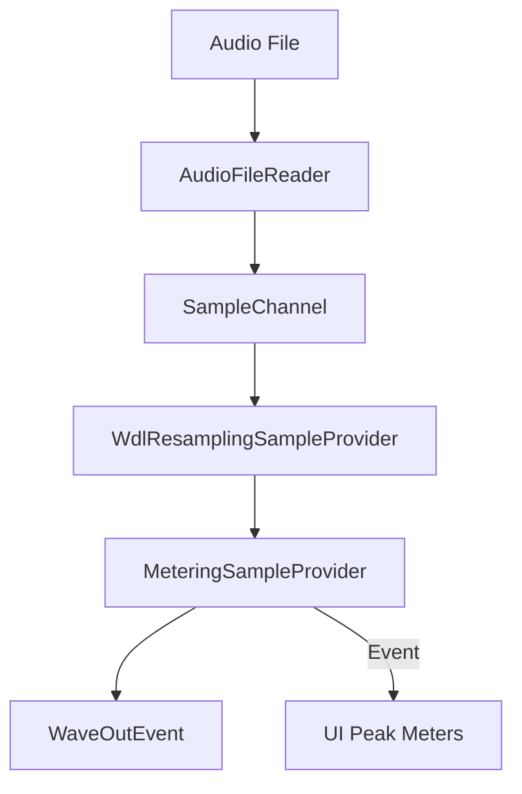

# High-Fidelity Audio Engine (NAudio Implementation)

## Overview
As of December 25, 2025, ORBIT has transitioned its primary audio engine from LibVLC to **NAudio**. This shift was driven by the need for low-level signal processing (VU meters, spectral analysis) and tighter integration with professional DJ analysis formats (Rekordbox ANLZ).

## 1. Architecture
The audio pipeline follows a Producer-Consumer model optimized for low-latency UI updates:

### Key Components
- **AudioPlayerService**: High-level wrapper implementing `IAudioPlayerService`.
- **MeteringSampleProvider**: Captures real-time channel peaks without blocking the playback thread.
- **WaveOutEvent**: Provides the primary output buffer with a `DesiredLatency` of 100ms.

## 2. Real-Time VU Meters
VU meters are driven by the `AudioLevelsChanged` event, which fires every 50ms (20fps). 
- **Decay Simulation**: The UI employs a custom `VuHeightConverter` for visual scaling.
- **Range**: -60dB to 0dB (clipping detection planned).

## 3. Waveform Visualization (`WaveformControl`)
The custom `WaveformControl.cs` provides a high-performance rendering surface for track peaks.

### Dual-Source Rendering
1. **Rekordbox ANLZ**: If a `.DAT` or `.EXT` file is found, the player parses the `PWAV` tag for an instant, high-fidelity waveform.
2. **Local Analysis**: (Future) Fallback to on-the-fly peak generation using `AudioFileReader`.

### Companion Probing
The service automatically scans for analysis data in:
- The track's parent directory (`SameName.DAT`)
- `ANLZ/` subfolders (Rekordbox local database style)
- `PIONEER/USBANLZ/` structures (Rekordbox USB style)

## 4. Professional Features
- **Pitch/Tempo Control**: A hardware-style slider (±10%) allows for precise tempo previewing.
- **Persistent Queue**: The play queue is persisted to SQLite, allowing users to resume their session exactly where they left off.
- **Background Safety**: The engine uses a dual-layer lock (PlayerViewModel + OS lock) to prevent `File In Use` errors during library upgrades.

---
**Status**: Sprint B Complete  
**Engine**: NAudio 2.2.1  
**Last Updated**: 2025-12-25
